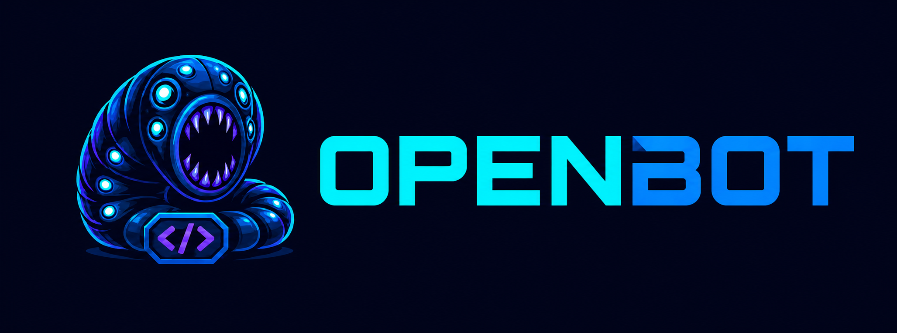
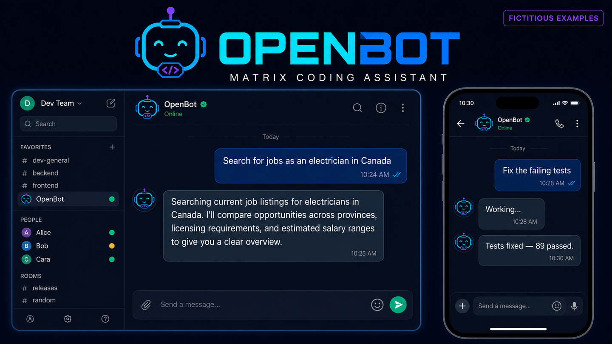

<p align="center">
  
</p>

# Matrix–OpenCode bot

An end-to-end encrypted Matrix bot that controls an OpenCode coding session. Each
authorized Matrix room maps to one OpenCode session, ordinary messages become
prompts, and responses are streamed back by editing a Matrix message.

The bot connects to an `opencode serve` process through its HTTP API. The included
`run.sh` launcher starts and supervises both processes for local use.

## Example chats



*Fictitious examples showing how OpenBot conversations can look in Element on
desktop and mobile.*

## Requirements and setup

- Python 3.11+
- OpenCode with a working provider/model configuration
- A dedicated Matrix account and an encrypted Matrix room
- On some Linux systems, `matrix-nio[e2e]` also needs `libolm-dev`, Python headers,
  and a C compiler

Create the environment and install the project:

```bash
python3 -m venv .venv
. .venv/bin/activate
pip install -e .
cp .env.example .env
```

After configuring `.env`, start both OpenCode and the bot with:

```bash
./run.sh
```

The launcher loads `.env`, starts OpenCode when needed, waits for it to become
healthy, then starts the bot. If a healthy server is already listening at
`OPENCODE_URL`, the launcher reuses it and leaves it running when the bot stops.
Otherwise, Ctrl-C stops both processes. By default OpenCode serves on
`127.0.0.1:4096`; optional `OPENCODE_SERVER_HOSTNAME` and
`OPENCODE_SERVER_PORT` values in `.env` can change that, and `OPENCODE_URL` must
point to the same address.

To run the processes separately instead, start OpenCode on loopback with Basic
Auth (using the same password as `.env`):

```bash
OPENCODE_SERVER_PASSWORD='a-strong-separate-password' \
  opencode serve --hostname 127.0.0.1 --port 4096
```

Then load the configuration and run the bot in another terminal:

```bash
set -a
. ./.env
set +a
matrix-opencode
```

The first run logs in with `MATRIX_PASSWORD`, creates a Matrix device, and stores
the access token and encryption keys under `MATRIX_DATA_DIR`. Remove the Matrix
password from `.env` after the first successful login. Keep the entire data
directory private and persistent. Existing `data/session.json` and
`data/crypto_store` files from the ELIZA example are reused unchanged.

After the initial sync, the bot posts an OpenBot welcome banner to every allowed
room it has joined. The banner is sent as native Matrix image media, including
encrypted-media metadata for encrypted rooms and dimensions that Element uses to
scale it cleanly on mobile and desktop.

Verify the new **Matrix OpenCode bot** device in Element or another full Matrix
client. The bot refuses to send to unverified recipient devices by default.
`MATRIX_IGNORE_UNVERIFIED_DEVICES=true` permits unattended use but weakens device
identity assurance; message contents remain encrypted.

## Access policy

`MATRIX_ALLOWED_ROOMS` and `MATRIX_ALLOWED_SENDERS` are mandatory comma-separated
allowlists. An accepted command must satisfy both. Everyone on the sender list in
a room shares control of that room's OpenCode session, including permission
decisions and aborts.

`OPENCODE_DEFAULT_DIRECTORY` must be an existing directory beneath one of the
existing directories in `OPENCODE_ALLOWED_ROOTS`. Separate roots using the
platform path separator (`:` on Linux/macOS). `!new relative/path` resolves from
the default directory; absolute paths are also accepted when their fully resolved
target remains beneath an allowed root. This rejects `..` traversal and symlink
escapes.

Protect the OpenCode server with `OPENCODE_SERVER_PASSWORD`, bind it to loopback,
and do not expose port 4096 publicly. The username defaults to `opencode`.

## Commands

- `!help` — show the command list
- `!new [directory]` — create a new session, using the default directory when omitted
- Ordinary messages — prompt the current session, creating one in the default directory if needed
- `!pursue <goal>` — choose extent 1–3, then pursue until independently verified or `!stop`
- `!status` — show the session, directory, activity, permissions, and change totals
- `!diagnose` — write `DIAGNOSIS.txt` in the mapped session directory
- `!bump` — report inactivity and ask before restarting the same stalled turn
- `!bump confirm` / `!bump cancel` — approve or cancel the proposed restart
- `!diff` — show unified diffs for the session
- `!stop` — abort the current operation
- `!reset` — discard only the room mapping

The first ordinary message in an unmapped room automatically creates a session in
`OPENCODE_DEFAULT_DIRECTORY`. Use `!new [directory]` when you want to choose a
different workspace. One prompt at a time is accepted per room. `!reset` neither
deletes the OpenCode session nor reverts files, and it is refused while the
session is busy. New sessions also leave earlier OpenCode sessions and their
changes intact.

`!diagnose` snapshots the mapped room state, transient progress, the last 200
OpenCode event records observed since the bot started (with adjacent token deltas
compacted), server health/status, and up to
100 recent messages plus diffs for the worker, verifier, and quarantined recovery
sessions. The report is written atomically with owner-only permissions and the bot
replies with its absolute path. Credential-shaped fields and assignments are
redacted, but arbitrary prompts, model/tool output, paths, and source diffs can
still contain private data. Inspect `DIAGNOSIS.txt` before copying or sharing it.

Starting a session posts a compact reminder of the available commands. `!pursue`
first asks for an extent: `1` reaches the evidenced goal, `2` checks the important
alternatives and contradictions, and `3` systematically exhausts every plausible
avenue and may run for hours. After the choice, it starts a fresh worker, preventing
a large or poisoned ordinary-chat transcript from contaminating the pursuit. It also creates
a separate verifier session that freezes task-aware acceptance criteria. The bot
assigns stable IDs to those criteria, so completion does not depend on the model
repeating punctuation exactly. Literal schema placeholders and duplicate criteria
are rejected instead of becoming the contract. The worker then acts in repeated
passes while the verifier independently checks evidence after every pass. Passing
evidence records a claim, its direct source URL/file/check, and how the verifier
checked it. The pursuit completes automatically only when all mandatory criteria
pass. Material ambiguities pause for an ordinary Matrix reply; difficulty or lack
of immediate progress does not stop the loop.

Pursuits survive bot restarts and have no overall pass or token limit. Verifier
feedback, structured evidence, failed approaches, and unresolved gaps are
persisted by criterion ID. A verdict is fully validated before any of its status or
evidence is stored. Three passes with the same gap and no new evidence trigger a
fresh worker context with that durable memory. The next pass also rotates to a
fresh worker when cumulative input reaches
`OPENCODE_PURSUE_CONTEXT_INPUT_TOKENS` (250,000 by default). Pursuit workers use
direct, observable tools; delegated `task` calls are disabled. `!stop` clears the
pursuit, aborts its active worker or verifier turn, and removes the temporary
verifier session.

When upgrading an active pursuit from the older free-form evidence protocol, the
bot retains its goal and explicit `User clarification:` entries, creates fresh
worker and verifier sessions, and regenerates the contract. Old OpenCode sessions
remain available for audit, while old criteria and unverified evidence are not
carried forward.

Verification adapts to the task: code work favors executable checks, web research
checks source authority, identity, recency, claim coverage, and contradictions,
and qualitative work uses a frozen rubric while separating sourced facts from
inference. The verifier is instructed not to edit or take consequential actions;
OpenCode's normal permissions still govern every tool call.

Assistant text and safe progress are relayed through Matrix `m.replace` edits at
most once per `MATRIX_EDIT_INTERVAL_SECONDS` (five seconds by default, to stay
below typical homeserver rate limits). The interval is measured from every successful
outgoing room message, so a live edit does not immediately follow a command reply,
permission prompt, or initial progress message. While busy, the progress message shows elapsed time, the
current plan item, plan completion, recent phases, tool names and status, retries,
subagents, and file-update counts. Raw hidden reasoning, tool arguments, and
commands are not posted; user-visible plan descriptions may mention files.
Permission requests and errors are sent immediately. Replies longer than 20,000
characters are split at completion.

Both the current OpenCode `permission.asked` event schema and the legacy
`permission.updated` schema are normalized. This is especially important for
`external_directory`: an operation targeting a path outside the session worktree
is paused and surfaced in Matrix for `y` or `n`, rather than appearing as
an indefinitely running tool. These replies are interpreted as permission answers
only while the room has a pending request; otherwise they remain ordinary messages.

An in-process watchdog checks active bot-submitted prompts every 30 seconds.
Ordinary turns use `OPENCODE_STUCK_TIMEOUT_SECONDS` (900 seconds by default).
Pursuits use the shorter `OPENCODE_PURSUE_STUCK_TIMEOUT_SECONDS` (180 seconds),
and a pursuit tool continuously reported as running has its own hard ceiling,
`OPENCODE_PURSUE_TOOL_TIMEOUT_SECONDS` (120 seconds). A timeout aborts the turn,
quarantines the poisoned pursuit worker or verifier session, and resumes the same
phase in a fresh session with a durable warning not to repeat the failed approach.
Each repeated recovery requires another full timeout, and `!stop` cancels automatic
continuation. If OpenCode initially rejects the abort, the watchdog retries on its
next 30-second check rather than waiting through another timeout. Pending permission
requests are never interrupted. `!status` shows
the active deadline as a countdown. The watchdog also
reconciles missed idle events and OpenCode's occasional stale `busy` status by
requiring a completed timestamp on the latest assistant message before treating a
busy response as finished.

When a watchdog deadline is reached, the bot sends a new Matrix room message—not
only a replacement edit—so clients can generate a notification for the recovery.
External-directory and other permission requests likewise arrive as new messages
with explicit `y` / `n` instructions.

`!bump` exposes the same recovery mechanism under explicit user control. It
reports time since the last observable activity and compares it with the watchdog
threshold, but never interrupts immediately. `!bump confirm` aborts and resumes
only if the same turn has remained unchanged; any intervening activity expires the
confirmation. During a pursuit, a confirmed bump also quarantines the active
session before resuming. Turns waiting for `y` or `n` are not considered
stalled.

Set `MATRIX_SHOW_REASONING=true` to also stream the provider-exposed reasoning
text that OpenCode displays in its thinking view. This text is shown only while
the response is in progress and is removed when the final answer replaces the
live message. It can contain sensitive workspace or prompt context, so enable it
only for rooms whose members are allowed to see that material.

## Persistence and recovery

Room mappings and in-flight Matrix event IDs are stored atomically in
`data/room_sessions.json` with owner-only permissions. On restart, the bot checks
that directories are still allowed and that sessions still exist. If a response
completed while disconnected, it reads recent OpenCode messages and finishes the
pending Matrix edit. Pending watchdog recovery state is also restored; active
restored prompts receive a fresh full silence window before intervention.

## Testing and smoke check

The test suite does not contact Matrix or OpenCode:

```bash
pip install -e '.[test]'
pytest
```

Before starting the bot, check the configured server manually:

```bash
curl -u "${OPENCODE_SERVER_USERNAME:-opencode}:${OPENCODE_SERVER_PASSWORD}" \
  "${OPENCODE_URL:-http://127.0.0.1:4096}/global/health"
```

Then invite the bot to an allowed encrypted room, verify its device, send a small
read-only prompt, and confirm `!status`, `!diff`, and permission handling.

## Security notes

- Use dedicated Matrix and OpenCode credentials and keep `.env` and `data/` out
  of version control.
- An allowed sender can ask OpenCode to read, edit, or execute within its own
  configured permissions. Keep OpenCode's permission policy restrictive.
- Matrix E2EE protects room events. HTTPS or loopback transport separately
  protects the connection to OpenCode.
- Interactive emoji verification, cross-signing, and key backup are not
  implemented by this bot.
